# Sierra Speakers Toastmasters: Macro Tutorial

A step-by-step guide for running the three automation macros in the Sierra Speakers schedule spreadsheet. Any member can use these tools. No technical background required.

---

## 1. Welcome

The Sierra Speakers schedule spreadsheet includes three built-in macros that handle the most time-consuming parts of meeting prep: sending role confirmation emails, generating a formatted agenda, and drafting the weekly club email. Everything runs from a single **Toastmasters** menu inside the spreadsheet you already use.

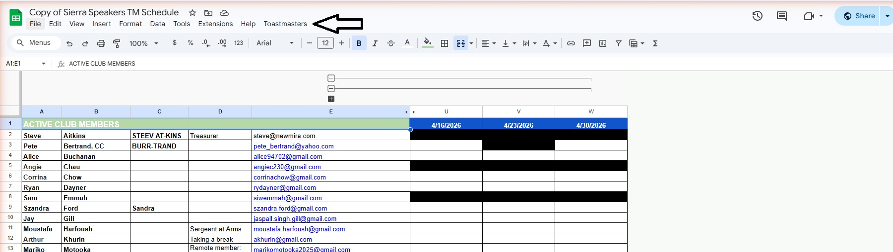

---

## 2. First Time Setup: Google Permissions Warning

The first time you run one of the macros, Google will show an **"This app isn't verified"** warning. This is completely normal. It appears because the script was written by your club's VP of Education, not a large software company that has paid Google for a formal verification audit.

Here is how to get past it (you only do this once):

1. When the warning appears, click **Advanced** (small link at the bottom-left).
2. Click **Go to [project name] (unsafe)**.
3. Review the permissions Google lists. The script needs access to your spreadsheet, permission to send email on your behalf, and permission to create Google Docs in your Drive. Click **Allow**.

**Why does it need these permissions?** The macros read your schedule to know who is assigned to each role, send confirmation emails from your Gmail, and create agenda documents in your Google Drive. That is all the script does. After you approve once, Google remembers your choice and you will never see the warning again.

If you are still unsure, ask a fellow member who has already approved it to walk you through the consent screen over a quick screen share.

---

## 3. How to Send Role Confirmations

This macro emails every member assigned to a role for a specific meeting date and asks them to confirm. It also gives you a live status board showing who has confirmed, who still needs to reply, and who cannot attend.

### Step 1: Open the Toastmasters menu

Click **Toastmasters** in the menu bar, then select **Start Role Confirmations**.

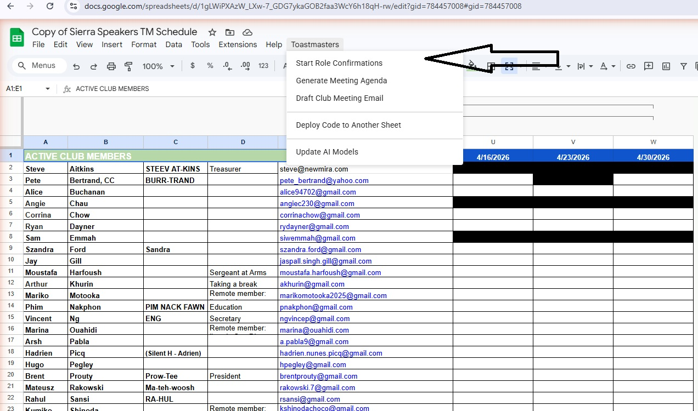

### Step 2: Confirm the schedule sheet

A small dialog asks whether to continue with the current schedule tab (for example, "SCHED 2026"). Click **Yes** if that is the correct schedule.

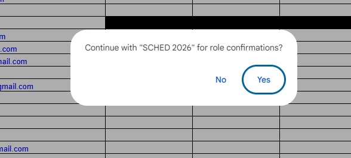

### Step 3: Pick the meeting date

The next dialog lists upcoming meeting dates from your schedule. The default is the next meeting. Click **OK** to accept it, or select a different date from the list.

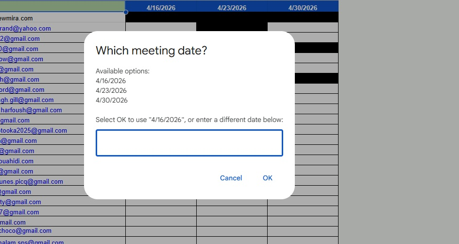

### Step 4: Review pending roles

The macro opens a **Pending Role Confirmations** panel. Each role is listed with the member's name and a color-coded status:

- **Confirmed**: the member has replied yes.
- **Email sent / Needs confirmation**: an email went out and you are waiting for a reply.
- **Unable to Attend**: the member said they cannot make it (this role needs to be reassigned).

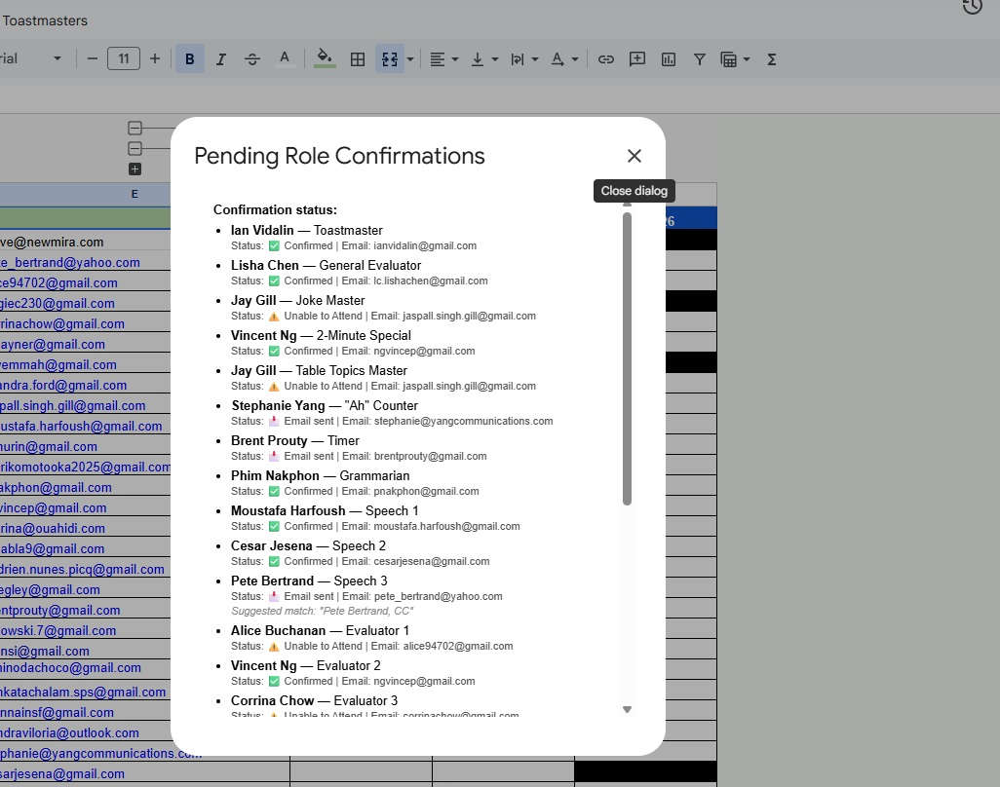

### Step 5: Fill in meeting details

Scroll down to the bottom of the Pending Role Confirmations panel. Here you can fill in:

- **Meeting Theme**: the theme for the meeting.
- **Meeting Format**: choose Hybrid, In Person, Virtual, or Undecided.
- **Word of the Day**: enter the WOD if you have one ready.
- **Sender**: choose which member's email the confirmations come from.

When everything looks right, click **Send Emails**. The macro creates email drafts; it does **not** send anything automatically. You will find the drafts in your Gmail.

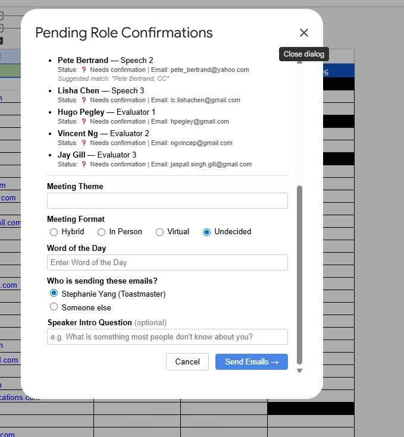

You can close the panel and re-run the macro later to refresh statuses and nudge anyone who still has not replied.

---

## 4. How to Generate a Meeting Agenda

This macro builds a polished Google Doc agenda and places it in your club's Drive. It pulls the Toastmaster, speakers, evaluators, theme, and all role assignments from the schedule automatically.

### Step 1: Open the Toastmasters menu

Click **Toastmasters > Generate Meeting Agenda**.

### Step 2: Pick the meeting date

The same date picker from the role confirmations flow appears. Select the meeting date and click **OK**.

### Step 3: Enter the Word of the Day

A dialog asks you to type in the Word of the Day.

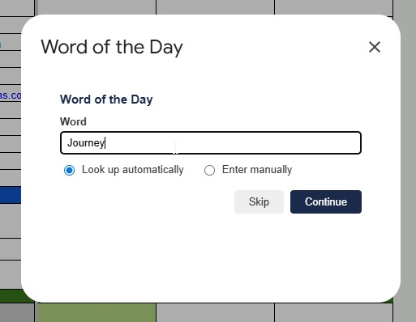

### Step 4: Pick a definition

The macro looks up your word and offers definition options for you to choose from. Pick the one you like best.

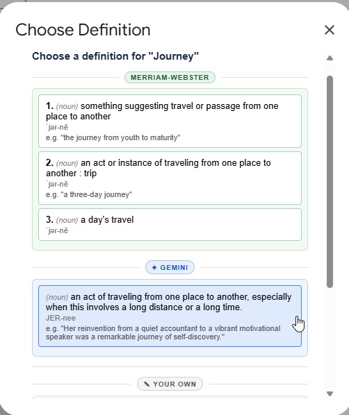

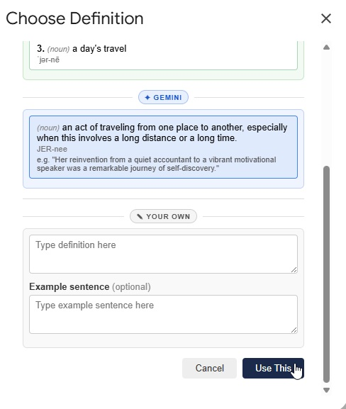

### Step 5: Confirm prepared speeches

The macro shows the speakers it found for this meeting. Each speech is listed with its title and the speaker's name. Uncheck any speech that is not happening. Click **Continue**.

The tool can also scan your Gmail inbox for emails from speakers about their upcoming speeches. If it finds relevant messages, it will auto-populate speech titles and Pathways information for you. If nothing is found in your inbox, it falls back to whatever is already on the schedule sheet. This saves time compared to tracking down titles and pathway levels manually.

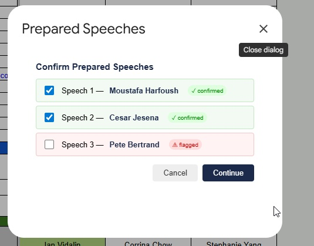

### Step 6: Confirm evaluators

Next, confirm the evaluator assignments. The macro pairs each speaker with their assigned evaluator. Make any adjustments and click **Continue**.

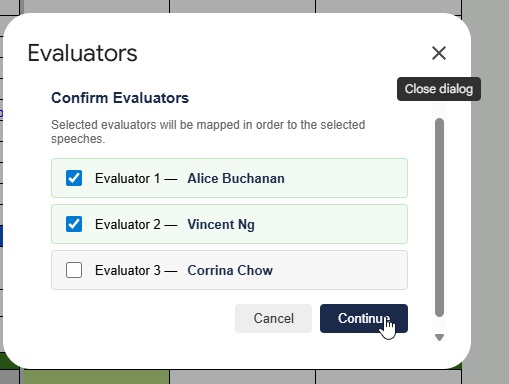

### Step 7: Agenda generates

The macro builds the agenda document. You will see a progress indicator while it works.

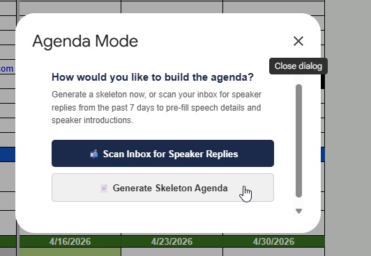

### Step 8: Get the agenda link

When the agenda is ready, a popup shows you the link. Click it to review your agenda. The link is automatically saved and will pre-fill in the club email dialog later.

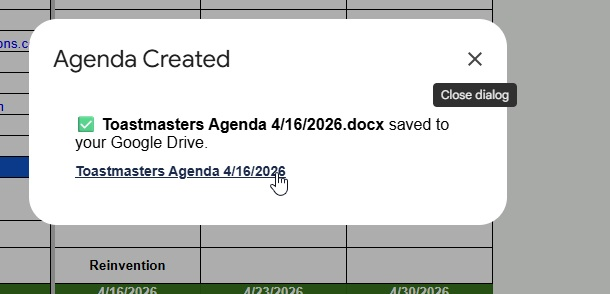

### Step 9: Review the finished agenda

The generated Google Doc is ready to share with your club. Open it, review the content, make any last tweaks, and share the link with your members.

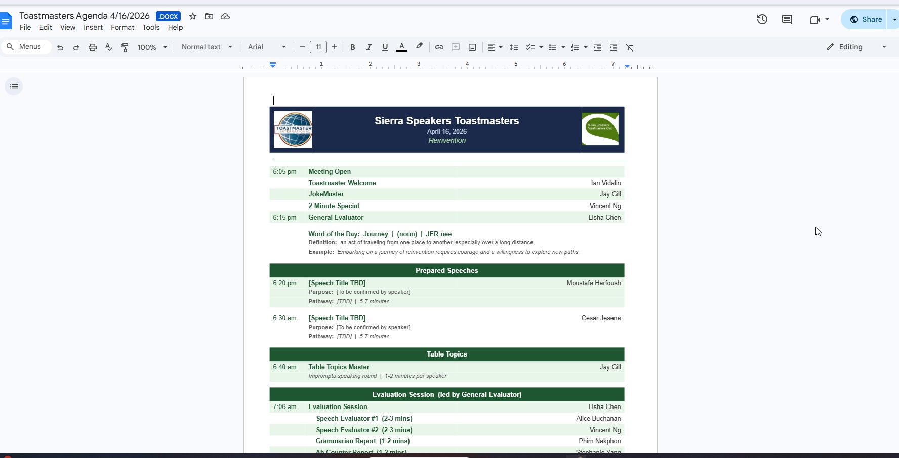

---

## 5. How to Draft the Club Meeting Email

This macro creates the weekly meeting reminder email and saves it as a Gmail draft. Nothing is sent until you open the draft and press **Send** yourself.

### Step 1: Open the Toastmasters menu

Click **Toastmasters > Draft Club Meeting Email**.

### Step 2: Fill in the email form

A dialog collects everything the email needs. Most fields come pre-populated from your earlier answers (theme, Word of the Day, agenda URL, and meeting format), so you do not need to re-enter everything from scratch. You can overwrite any field if something needs to change.

- **Meeting Format**: Hybrid, In Person, or Virtual (radio buttons at the top).
- **Theme**: the meeting theme (pre-filled if you entered one during role confirmations).
- **Word of the Day**: the WOD you used when generating the agenda (pre-filled).
- **Agenda URL**: the agenda link from the previous section (pre-filled automatically).
- **CC / BCC**: optionally add guest email addresses.

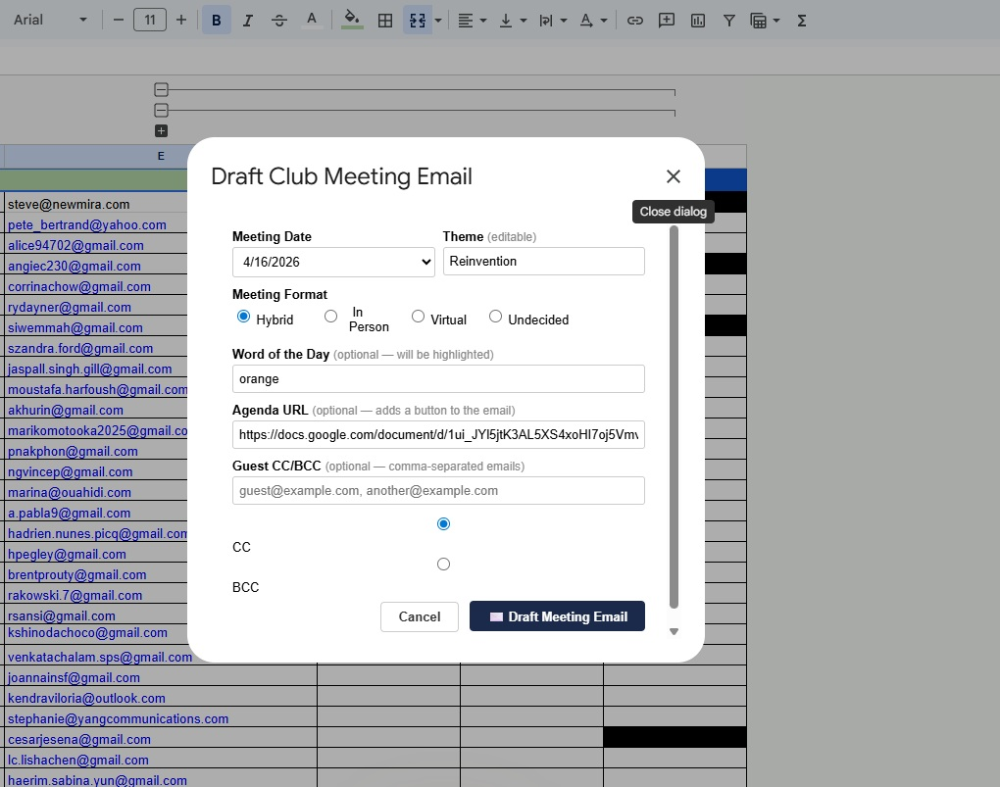

### Step 3: Confirm and draft the email

Review the form, make any changes, and click **Draft Meeting Email**. A confirmation appears when the draft has been created.

### Step 4: Review and send from Gmail

Open Gmail, find the draft under **Drafts**, read it over once, and click **Send**. This last step is always yours. The macro never sends anything on its own.

---

## Appendix

### A. Understanding the Color Coding

The schedule grid uses color coding so you can see the state of every role at a glance.

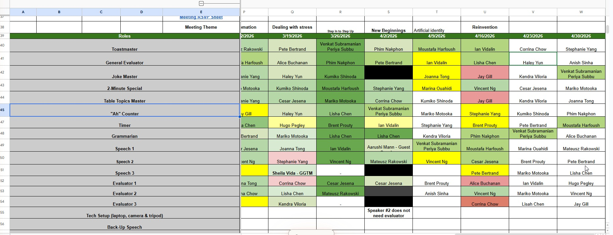

- **Green**: the member has confirmed their role for this meeting.
- **Red**: this role needs reassignment (the member cannot attend or has not been filled).
- **Yellow**: the member has been contacted but has not yet replied.

When you run **Start Role Confirmations**, the colors update automatically based on member responses.

---

### B. Tips and Reminders

- **Always review drafts before sending.** The macros create Gmail drafts, never send directly. Take a moment to read each draft before hitting Send.
- **Run confirmations early in the week.** This gives members time to reply and lets you handle any swaps before the meeting.
- **Generate the agenda before drafting the club email.** The agenda URL will pre-fill into the email form automatically, saving you a step.
- **Re-run Role Confirmations as needed.** If someone swaps roles or a new reply comes in, run the macro again. It only emails people who have not already been contacted.
- If you see a **"Running script"** banner at the top of the spreadsheet, just wait. Google is processing the macro. Do not click anything until it finishes or a dialog appears.
- The **Toastmasters** menu only appears once the spreadsheet has fully loaded. If you do not see it right away, wait a few seconds.

---

## Need Help?

Ask your VP of Education or the member who set up the spreadsheet. This tutorial and all screenshots live in the `github-repo/docs` folder alongside the rest of the Sierra Speakers materials.
